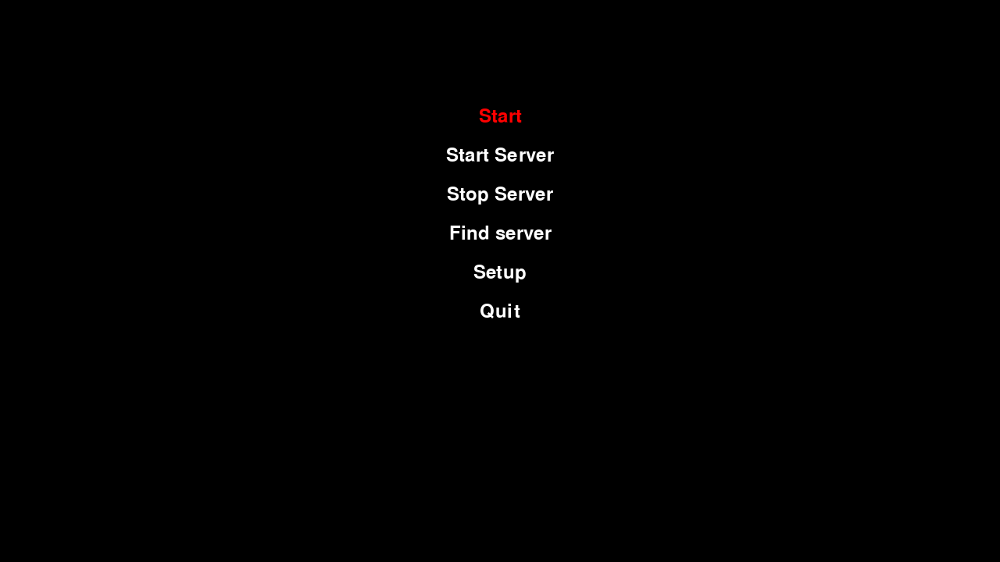
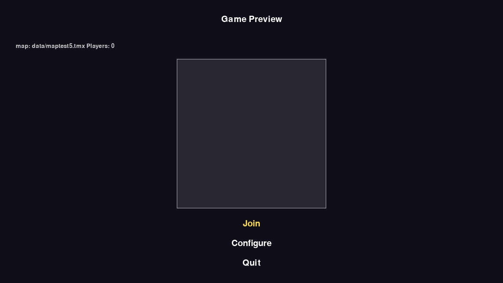
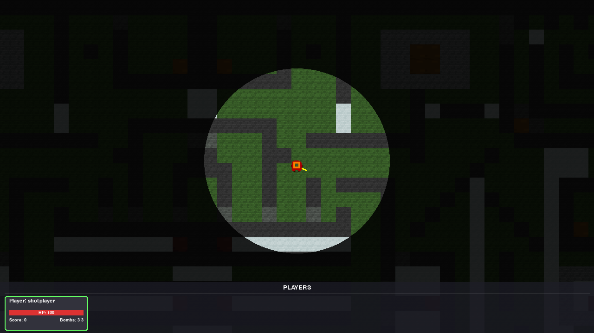

# bomberdude

A multiplayer Bomberman-style clone written in Python with `pygame`.





## Features

- Bombs.
- LAN server discovery.
- A connection lobby.
- Player accounts are stored server-side in SQLite.
- In-game settings.

## Requirements

Python 3.10+, and:

- `pygame`
- `pytmx`
- `aiohttp`
- `requests`
- `loguru`
- `pycryptodome`
- `argon2-cffi`

## Running

Start a server:

```sh
python bombserver.py --map data/maptest5.tmx
```

Then run the client:

```sh
python bdude.py
```

### Client flags (`bdude.py`)

| flag | default | purpose |
|---|---|---|
| `--server` | `127.0.0.1` | server IP to connect to |
| `--server_port` | `9696` | server's game (TCP) port |
| `--api_port` | `9691` | server's HTTP API port |
| `--username` / `--password` | — | account credentials; skips the in-game auth dialog if both are set (`--password` takes a plain-text value, which is encrypted before any local storage) |
| `--config` | `bdude_config.json` | path to the local settings/credentials file |
| `--autoconnect` | off | skip the main menu and connect immediately |
| `--map` | `data/maptest5.tmx` | map to load |
| `-d`, `--debug` | off | verbose logging |
| `-g`, `--debug_gamestate` | off | verbose gamestate/event logging |

### Server flags (`bombserver.py`)

| flag | default | purpose |
|---|---|---|
| `--listen` | `127.0.0.1` | address to bind |
| `--server_port` | `9696` | game (TCP) port |
| `--api_port` | `9691` | HTTP API port (auth, lobby info, map data) |
| `--map` | `data/maptest5.tmx` | map to serve |
| `-d`, `--debug` | off | verbose logging |
| `-g`, `--debug_gamestate` | off | verbose gamestate/event logging |

The server persists player accounts to `data/players.db`. The client's saved
credentials live alongside the config file (e.g. `bdude_config.json`), with
an AES key file (`<config path>.key`) generated next to it on first use.
